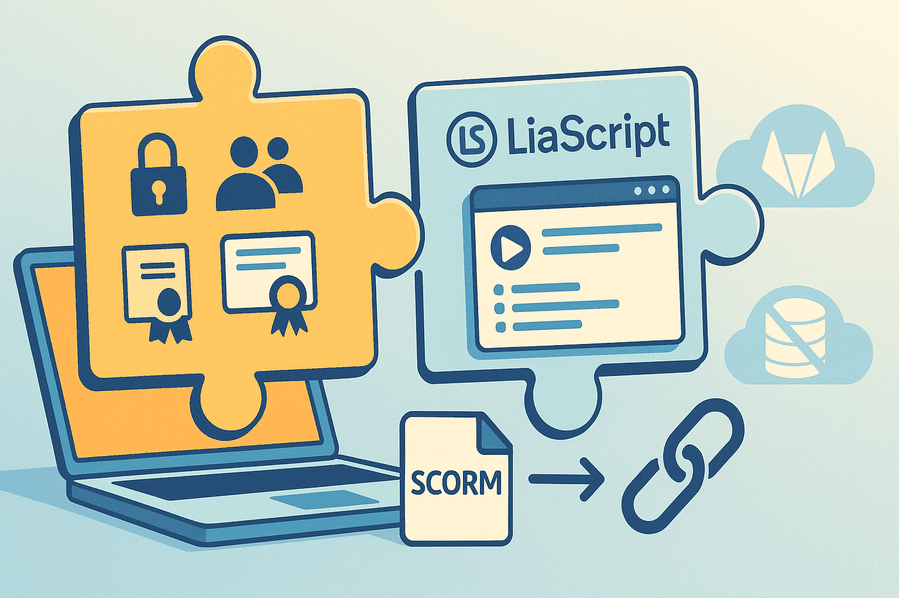

<!--
author:   André Dietrich; Sebastian Zug; GitHub-Copilot

email:    Andre.Dietrich@informatik.tu-freiberg.de;
          Sebastian.Zug@informatik.tu-freiberg.de

language: de

edit:     true

narrator: German Male

version:  0.0.3

comment:  Kurzvorstellung LiaScript im Vergleich zu Authoring-Tool in klassischen LMS

mode:     Slides

import:   https://raw.githubusercontent.com/liaTemplates/ABCjs/main/README.md
          https://raw.githubusercontent.com/liaTemplates/webserial/main/README.md
          https://raw.githubusercontent.com/liaTemplates/MicroBit-Simulator/main/README.md

link:     ./style.css

@style
@keyframes burn {
  0% { text-shadow: 0 0 5px #ff0, 0 0 10px #ff0, 0 0 15px #f00, 0 0 20px #f00, 0 0 25px #f00, 0 0 30px #f00, 0 0 35px #f00;
  }
  50% { text-shadow: 0 0 10px #ff0, 0 0 15px #ff0, 0 0 20px #ff0, 0 0 25px #f00, 0 0 30px #f00, 0 0 35px #f00, 0 0 40px #f00;
  }
  100% { text-shadow: 0 0 5px #ff0, 0 0 10px #ff0, 0 0 15px #f00, 0 0 20px #f00, 0 0 25px #f00, 0 0 30px #f00, 0 0 35px #f00;
  }
}
.burning-text {
  font-weight: bold;
  color: #fff;
  animation: burn 1.5s infinite alternate;
}
.flex-container {
    display: flex;
    flex-wrap: wrap; /* Allows the items to wrap as needed */
    align-items: stretch;
    gap: 20px; /* Adds both horizontal and vertical spacing between items */
}

.flex-child { 
    flex: 1;
    margin-right: 20px; /* Adds space between the columns */
}

@media (max-width: 600px) {
    .flex-child {
        flex: 100%; /* Makes the child divs take up the full width on slim devices */
        margin-right: 0; /* Removes the right margin */
    }
}
@end

@burn: <span class="burning-text">@0</span>
-->

[](https://liascript.github.io/course/?https://raw.githubusercontent.com/LiaPlayground/LiaScript-Offene-OER-im-Browser/refs/heads/main/README.md)

# LiaScript – Offene OER im Browser

<h2>„LMS verwalten Bildung – LiaScript teilt sie.“</h2>


<section class="flex-container">

<div class="flex-child" style="min-width: 250px;">

**André Dietrich & Sebastian Zug**

**TU Bergakademie Freiberg**

> __Workshop der Co-WOERK Community, 20.11.2025__

</div>

<div class="flex-child" style="min-width: 250px;">

 erweitert um LiaScript Logo")

</div>

</section>

<!-- class="reference" -->
> Das Material zu diesem Foliensatz steht unter einer Creative Commons Lizenz. Die Inhalte finden sich auf [GitHub](https://github.com/LiaPlayground/LiaScript-Offene-OER-im-Browser)

## 0. Agenda

> Mit diesem Vortrag wollen wir folgende Leitfragen bezüglich LiaScript adressieren:
> 
> 0. __Gestaltungsbandbreite:__ Welche Lehr-Lern-Features kann ich mit LiaScript umsetzen?
> 1. __Erarbeitung:__ Wie erfassen Autoren ihre Inhalte mit LiaScript ganz praktisch - welche Werkzeuge benötigen Sie dafür?
> 2. __Kooperation:__ Wie gut können Autoren kollaboarativ/kooperativ an Inhalten arbeiten?
> 3. __Wiederverwendung:__ Welche Export-Formate unterstützt das System?
> 4. __Best Practice:__ Welche Muster bei der Nutzung haben sich bewährt?
> 
> ... dabei aber auch die Vision von LiaScript als offenes Authoring-Tool im Browser vorstellen.


      {{0-1}}
<!-- class="reference" -->
> **Hinweis:** Bewegen Sie sich mit der Maus anhand der vorwärtsrück/rückwärts Pfeile (unten links) oder mit den Pfeiltastens auf dem Keyboard durch die Demo.

## 1. Einführung: Warum LMS bei OER an ihre Grenzen stoßen

    --{{0}}--
Sie kennen das Problem: Sie erstellen einen Kurs in Moodle oder ILIAS – und die Inhalte verschwinden in einer Datenbank. Export? Kompliziert. Teilen mit anderen Hochschulen? Noch komplizierter. Plugin-Update? Ihr Kurs funktioniert plötzlich nicht mehr. Das ist das Gegenteil von Open Educational Resources.

__Was sind typische Probleme bei der Materialerstellung und -nutzung in einem LMS:__

- Inhalte werden in Datenbanken gespeichert → nicht offen
- Kein einfacher Export oder Wiederverwendung
- Hohe Einstiegshürden für Autor:innen
- Abhängigkeit von Plugins und Systemversionen
- Funktioniert nur online

     {{1}}
> **These:** OER braucht eine eigene Sprache, offen, textbasiert und versionsfähig.

## 2. LiaScript – Eine neue Denkrichtung

    --{{0}}--
LiaScript ist reines Markdown – eine Textdatei, die jeder lesen, bearbeiten und teilen kann. Aber mit Superkräften: Quizze, Animationen, Text-to-Speech, Code-Ausführung, alles direkt im Browser. Kein Server, keine Installation, keine Datenbank. Ihre Inhalte bleiben eine einfache Datei und können damit mit unterschiedlichsten Mechanismen geteilt und genutzt werden. Damit eröffnen sich ganz neue Möglichkeiten für die Erstellung und Verbreitung von OER.

``` ascii
+-------------------------------------+     +-------------------------------------+     +-------------------------------------+
|              Features               |     |              Hosting                |     |            Kollaboration            |
+-+-----------------------------------+     +-+-----------------------------------+     +-+-----------------------------------+
  |                                           |                                           |
  o-- #️⃣ Markdown Syntax                      o-- 📝 Eigener WebSpace:                    o-- Direkt / Echtzeit
  |                                           |      CodiMD / HedgeDoc                    |
  o-- ✨ Animationen (3 Darstellungsmodi)     |                                           o-- Asynchrone / Versionen
  |                                           o-- 🗂️ Versionsverwaltung:                  |
  o-- 🗣️ Text-to-Speech                       |      GitHub / GitLab / Codeberg           o-- Erweitert / KI
  |                                           |                                           |
  o-- 📊 Automatische Visualisierung          o-- 📤 File-Sharing:                        o-- Klassenraum / Lernen
  |                                           |      OnionShare / NextCloud               
  o-- 🧑‍💻 Live Coding                          |                                         +-------------------------------------+
  |                                           o-- 🕸️ Peer 2 Peer:                       |            Klassenräume             |
  o-- 🖼️ ASCII-Art                            |      IPFS / WebTorrent                  +-+-----------------------------------+  
  |                                           |                                           |
  o-- 🚀 JavaScript (First Class Citizen)     o-- 🌐 Soziale Netze:                       o-- Browserbasiert
  |                                           |      Data-URIs / Nostr                    |
  o-- 🧩 Erweiterungen mit Macros             |                                           o-- Chats
  |                                           |                                           |
  o-- ❓ Quizze / 🗳️ Umfragen                 |                                           o-- Sync. (Quiz / Umfrage / Code)
+-------------------------------------+       +-------------------------------------+     

```

> **Leitfrage 1 beantwortet:** Was heißt das für die Bearbeitung der Inhalte? → Autoren können einen einfachen Texteditor nutzen.

<!-- class="reference" -->
> **Hinweis:** Klicken Sie gern auf den Button mit dem Stift in einem Kästchen rechts oben, um in den Live-Editor für dieses Material zu öffenen.

## 3. Demo: Hello LiaScript 🎬

      {{0-1}}
<!-- class="reference" -->
> **Hinweis:** Aktivieren Sie die Tonausgabe und den Präsentationsmodus, damit sich LiaScript von der _besten Seite_ zeigt. Ein Avatar führt Sie dann durch diesen Abschnitt.

    --{{0}}--
Lassen Sie mich zeigen, was möglich ist. Das hier ist eine einfache Markdown-Datei – aber sehen Sie, was passiert: Interaktive Tabellen, die zu Diagrammen werden. Multimedia-Inhalte – Audio, Video, 3D-Modelle. Sogar Code, der zu Musik wird. Und das Beste: Das funktioniert alles offline, im Browser, auf jedem Gerät. Von einem normalen Nokia-Handy bis zum Desktop.
!?[](media/avatar_0.webm)


    --{{1}}--
Das hier ist kein Trick – es ist Markdown mit erweiterten Funktionen. Keine Plugins zum Installieren, keine Admin-Rechte notwendig. Einfach schreiben, speichern, teilen.
!?[](media/avatar_1.webm)

     {{1-2}}
> <marquee>... Once you free your mind about a concept of Harmony and of music being "correct" you can do whatever you want ...</marquee>
>
> -- Giorgio Moroder (Erfinder der Disco-Musik)

    --{{2}}--
Eine einfache Tabelle wird automatisch visualisiert – der Autor entscheidet, wie die Daten dargestellt werden.
!?[](media/avatar_2.webm)

      {{2}}
| Tier              | Gewicht in kg | Lebensdauer (Jahre) | Mitogen |
| ----------------- | ------------: | ------------------: | ------: |
| Maus              |         0.028 |                  02 |      95 |
| Flughörnchen      |         0.085 |                  15 |      50 |
| Braune Fledermaus |         0.020 |                  30 |      10 |
| Schaf             |            90 |                  12 |      95 |
| Mensch            |            68 |                  70 |      10 |


    --{{3}}--
Oder als Heatmap – zehn verschiedene Visualisierungstypen sind integriert. Kein Plugin nötig.
!?[](media/avatar_3.webm)

      {{3}}
<!--
data-type="heatmap"
data-title="Seattle Average Temperature in Fahrenheit"
data-show
-->
| Seattle |  Jan |  Feb |  Mar |  Apr |  May |  Jun |  Jul |  Aug |  Sep |  Oct |  Nov |  Dec |
| -------:| ----:| ----:| ----:| ----:| ----:| ----:| ----:| ----:| ----:| ----:| ----:| ----:|
|       0 | 40.7 | 41.5 | 43.6 | 46.6 | 51.4 | 56.0 | 60.5 | 61.2 | 57.0 | 50.1 | 44.1 | 39.6 |
|       2 | 40.2 | 40.7 | 42.7 | 45.3 | 50.0 | 54.4 | 58.5 | 59.2 | 55.4 | 49.2 | 43.5 | 39.3 |
|       4 | 39.7 | 40.0 | 41.9 | 44.4 | 48.9 | 53.2 | 57.0 | 57.7 | 54.2 | 48.6 | 43.1 | 38.9 |
|       6 | 39.6 | 39.5 | 41.3 | 44.2 | 49.5 | 54.2 | 57.8 | 57.4 | 53.6 | 48.2 | 42.8 | 38.7 |
|       8 | 39.6 | 39.9 | 42.9 | 47.1 | 52.7 | 57.3 | 61.3 | 61.1 | 56.7 | 49.5 | 43.1 | 38.7 |
|      10 | 41.3 | 42.7 | 46.4 | 50.7 | 56.4 | 60.9 | 65.2 | 65.4 | 60.9 | 52.8 | 45.5 | 40.4 |
|      12 | 43.8 | 46.0 | 49.5 | 53.8 | 59.6 | 64.3 | 69.4 | 69.8 | 65.1 | 56.0 | 47.8 | 42.6 |
|      14 | 45.1 | 47.7 | 51.3 | 55.9 | 61.9 | 66.9 | 72.6 | 73.2 | 67.7 | 57.8 | 48.8 | 43.6 |
|      16 | 44.5 | 47.5 | 51.4 | 55.9 | 62.3 | 67.5 | 73.9 | 74.3 | 68.2 | 57.4 | 47.8 | 42.6 |
|      18 | 42.6 | 44.7 | 48.7 | 53.8 | 60.3 | 65.9 | 72.3 | 72.2 | 64.6 | 53.9 | 46.0 | 41.2 |
|      20 | 42.0 | 43.3 | 46.4 | 50.2 | 56.0 | 61.4 | 66.9 | 66.6 | 60.7 | 52.3 | 45.2 | 40.7 |
|      22 | 41.4 | 42.5 | 45.0 | 48.3 | 53.5 | 58.2 | 63.2 | 63.5 | 58.7 | 51.1 | 44.5 | 40.1 |

    --{{4}}--
Multimedia – Audio, Video, 3D-Objekte – alles einbettbar mit einfacher Markdown-Syntax.
!?[](media/avatar_4.webm)

      {{5}}
?[ein Pferd](https://www.w3schools.com/html/horse.mp3 "ein Pferd hören")

    --{{6}}--
Videos können leicht eingebettet werden und wie man sieht, funktioniert LiaScript auch offline und auf Edge-Devices.
!?[](media/avatar_6.webm)


      {{6}}
!?[LiaScript auf Nokia](https://www.youtube.com/watch?v=U_UW69w0uHE)

    --{{7}}--
Oder interaktive 3D-Inhalte für Museumssammlungen, wissenschaftliche Modelle.
!?[](media/avatar_7.webm)

      {{7}}
??[Esthers Schriftrolle in einer Hülle](https://sketchfab.com/3d-models/esthers-scroll-in-a-cover-21a13eba33cb4343bab56f0c0f982876 "Historisches Museum der Stadt Krakau")

    --{{8}}--
Und jetzt wird's besonders: Programmieren lernen mit Musik. Der Code wird direkt ausgeführt – im Browser.
!?[](media/avatar_8.webm)


      {{8}}
```abc
X: 1
M: 4/4
L: 1/8
K: Emin
|:D2|"Em"EBBA B2 EB|~B2 AB dBAG|"D"FDAD BDAD|FDAD dAFD|
"Em"EBBA B2 EB|B2 AB defg|"D"afe^c dBAF|"Em"DEFD E2:|
```
@ABCJS.eval

    --{{9}}--
Ein Kurs – drei Modi: Als Präsentation wie jetzt, als Selbstlernkurs, mit Text-to-Speech, oder als interaktives Lehrbuch. Alles aus derselben Datei.
!?[](media/avatar_9.webm)


      {{9}}
> ## Quiz?
>
> **Wirst du LiaScript in Zukunft verwenden?**
>
> - [(X)] Ja, natürlich
> - [( )] Nicht sicher …
> - [( )] Nein, ich bleibe lieber bei einem klassischen LMS


## 4. Der Browser ist das neue Betriebssystem 🌐

    --{{0}}--
Warum brauchen wir dafür keinen Server? Weil moderne Browser heute selbst Server sind. Sie haben lokale Datenbanken, können Peer-to-Peer kommunizieren, Text vorlesen, auf Sensoren zugreifen. LiaScript nutzt diese Web-Standards – keine proprietären Lösungen. Das bedeutet: Ihre Kurse funktionieren heute, morgen und in zehn Jahren. Ohne Systemupdates, ohne Migrations-Projekte.

| Fähigkeit                                                                        | Beschreibung                      | Beispiel                        |
| -------------------------------------------------------------------------------- | --------------------------------- | ------------------------------- |
| [IndexedDB](https://de.wikipedia.org/wiki/Indexed_Database_API)                  | Lokale Datenbank                  | Speichern von Lernfortschritt   |
| [WebRTC](https://de.wikipedia.org/wiki/WebRTC)                                   | Realtime-Kommunikation            | Kollaboration, Chat             |
| [Sensor APIs](https://developer.mozilla.org/en-US/docs/Web/API/Sensor)           | Zugriff auf Kamera, GPS, Mikrofon | Experimente, Standort           |
| [WebAudio / TTS](https://developer.mozilla.org/en-US/docs/Web/API/Web_Audio_API) | Text-to-Speech                    | Barrierefreie (narrative) Kurse |
| [JavaScript](https://de.wikipedia.org/wiki/JavaScript)                           | Interaktive Logik                 | Simulationen, Code-Übungen      |
| [WebSerial API](https://developer.mozilla.org/en-US/docs/Web/API/Web_Serial_API) | Zugriff auf serielle Geräte       | Physik-Experimente, IoT         |
| WebUsb, WebBluetooth, WebNFC, ...                                                | Zugriff auf noch mehr Hardware    | ...                             |

    --{{1}}--
> **Leitfrage 7 beantwortet:**  beantwortet: Welche Plugins? Keine. Alle Funktionen sind Web-Standard.

### Von der Simulation zur Hardware

             --{{0}}--
Der BBC micro:bit ist ein kostengünstiges, programmierbares Board, entwickelt für Bildungszwecke:

??[Micro:Bit](https://sketchfab.com/3d-models/microbit-b453f11ad77a4545a33b3e0ecfba6fc5)

* __Prozessor:__ 32-bit ARM Cortex-M0 (Nordic nRF51822)
* __Sensoren:__ Beschleunigungssensor, Kompass (Magnetometer), Temperatur
* __LED-Matrix:__ 5×5 LEDs
* __Buttons:__ A und B
* __Kommunikation:__ Bluetooth Low Energy, I²C, SPI, UART
* __Stromversorgung:__ USB oder Batteriehalter für 2 × AAA

#### Demo MicroBit (Sim)
<!--
persistent: true
-->

          --{{0}}--
Nach dem Hochladen des folgenden Codes in den MicroBit-Simulator müssen Sie zunächst auf den Play-Button auf dem Board klicken, dann können Sie die Tasten A und B drücken, um 'A' bzw. 'B' auf der LED-Matrix anzuzeigen.

```python
from microbit import *

display.scroll("press A or B")

while True:
    if button_a.was_pressed():
        display.show('A')
    if button_b.was_pressed():
        display.show('B')
```
@microbit

#### Demo MicroBit (Real)

            --{{0}}--
Über die WebSerial-API können Sie den MicroBit auch direkt aus dem Browser steuern. Verbinden Sie den MicroBit über USB mit Ihrem Computer, erlauben Sie dem Browser den Zugriff auf das Gerät, und laden Sie dann den folgenden Code hoch. Der MicroBit zeigt eine scrollende Nachricht, liest die Temperatur und zeigt ein Herz auf der LED-Matrix an.


``` python
from microbit import *

# Display a scrolling message
display.scroll("Hello LiaScript!")

# Read the temperature
temp = temperature()
print("Temperature:", temp)

# Display a heart on the LED matrix
display.show(Image.HEART)
```
@WebSerial

<center><div style="resize: both; overflow: auto; min-height: 240px; min-width: 320px; border: 1px solid #ccc; padding: 0; margin-bottom: 10px; display: flex; justify-content: center; align-items: center;"><video autoplay="false" id="videoElement" style="display: none; max-width: 100%; max-height: 100%; object-fit: contain;"></video></div></center>

<script input="submit" default="Open Camera">
const video = document.querySelector("#videoElement")

if (video.srcObject === null) {
    if (navigator.mediaDevices.getUserMedia) {
        navigator.mediaDevices.getUserMedia({ video: true })
            .then(function (stream) {
                video.srcObject = stream
                video.style.display = "block"
                send.lia("Close Camera")
            })
            .catch(function (error) {
                console.log("Something went wrong!")
                send.lia("Camera Problem")
            });

        send.output("Waiting for Camera")
        "LIA: wait"
    } else {
        "No Camera connected"
    }
} else {
    const tracks = video.srcObject.getTracks()
    // Stop all tracks
    tracks.forEach(track => track.stop())
    video.style.display = "none"
    video.srcObject = null
    "Open Camera"
}
</script>


## 5. Vergleich: LMS vs. LiaScript ⚖️

    --{{0}}--
Hier die Leitfragen auf einen Blick: Erfassung? Markdown statt Formulare. Kollaboration? Git statt geschlossener Systeme. Standards? SCORM, IMS – alles dabei. Export? SCORM, PDF, Standalone – ohne Vendor-Lock. Plugins? Null. Kompatibilität? Markdown ist seit 20 Jahren stabil – Ihre Kurse funktionieren auch 2045 noch.

| Aspekt          | Klassisches LMS    | LiaScript                          |
| :-------------- | :----------------- | :--------------------------------- |
| Erfassung       | Formulare, Plugins | Markdown /Text                     |
| Kollaboration   | Intern, beschränkt | Git + kollaborative Editoren       |
| Standards       | SCORM, IMS         | SCORM, IMS, PDF, Web               |
| Export          | oft proprietär     | SCORM / IMS / Standalone           |
| Erweiterbarkeit | Plugins            | Makros & JavaScript & Bibliotheken |
| Kompatibilität  | versionsabhängig   | Markdown = zukunftssicher          |

    --{{1}}--
LiaScript ersetzt kein LMS – es macht Ihre Inhalte frei.

### javaScript


<script>12*33</script>


{{1}}
Russland startete seine Invasion in der Ukraine vor
<script format="relativetime" unit="days">
// Define the start date of the invasion
const invasionStartDate = new Date('2022-02-24');

// Get the current date
const currentDate = new Date();

// Calculate the difference in milliseconds
const differenceInMs = currentDate - invasionStartDate;

// Convert milliseconds to days
const differenceInDays = differenceInMs / (1000 * 60 * 60 * 24);

// Calculate the number of full days
const daysSinceInvasion = Math.floor(differenceInDays);

-daysSinceInvasion
</script>.


    {{2}}
<section>

longitude: <script default="13.33125" input="range" output="longitude">@input</script>

latitude: <script default="50.92558" input="range" output="latitude">@input</script>

<script run-once="true" style="display: block">
  fetch("https://api.open-meteo.com/v1/forecast?latitude=@input(`latitude`)&longitude=@input(`longitude`)&hourly=temperature_2m")
    .then(response => response.json())
    .then(data => {
      let table = "<!-- data-show data-type='line' data-title='Open-Meteo Weather API' -->\n"

      table += "| Time | Temperature |\n"
      table += "| ---- | ----------- |\n"

      for (let i=0; i < data.hourly.time.length; i++) {
        table += "| " + data.hourly.time[i] + " | " + data.hourly.temperature_2m[i] + " |\n"
      }
      send.lia("LIASCRIPT: "+table) }
    )
    .catch(e => {
      send.lia("ups, something went wrong")
    })
  "waiting for the weather"
</script>

</section>


### Templates vs Plugins

<!-- style="width: 100%" -->

    {{1}}
!?[](https://www.youtube.com/watch?v=Sh6ArZD_4Gw)


{{2}} https://github.com/topics/liascript-template

### Klassenräume vs Kurse

    {{0-1}}
<!-- style="width: 100%" -->


    {{1-2}}
!?[LiaScript Klassenräume](https://www.youtube.com/watch?v=Kjk6OblugXI)

## 6. Kollaboration & KI-Co-Creation 🤝🤖

    --{{0}}--
Leitfrage 2: Wie arbeiten Autoren zusammen? Sie haben die Wahl: Für technisch versierte Nutzer gibt es Git mit Versionierung, Merge-Requests und Branches. Aber es geht auch ganz einfach – mit kollaborativen Markdown-Editoren wie dem LiaScript LiveEditor, HedgeDoc oder CodiMD. Echtzeit-Kollaboration wie bei Google Docs, nur für Bildungsinhalte. Und weil es Textdateien sind, können Sie die Datei im Notfall auch einfach per E-Mail hin und her schicken – so simpel kann OER sein.

      {{0-1}}
**********************************************************

<!-- style="width: 75%" --> 

> Wer kollaboriert eigentlich mit wem? Lehrende mit Lehrenden, Lehrende mit Lernenden – oder sogar Lernende mit Lernenden. Alle können gemeinsam an Inhalten arbeiten, Feedback geben, Fragen stellen [vgl. TUBAF LiaScript-Kurse](https://github.com/TUBAF-IfI-LiaScript).

> Was aber passiert in Fällen, wo Lernende keine Erfahrung beim Einsatz von Authoring-Tools haben? Hier gehen wir den Umweg über Annotationen in pdf-Dokumenten.

    --{{1}}--
Und jetzt wird's spannend: KI-Assistenten können direkt mitschreiben. Quizfragen generieren, Texte übersetzen, interaktive Elemente erstellen. Das ist echte Co-Creation – zwischen Menschen und zwischen Mensch und Maschine. Ohne Plattform-Lock-in.

**********************************************************
      {{1-2}}
**********************************************************

 <!-- style="width: 75%" --> 

> Probieren Sie es aus - bitten Sie Ihre KI einen LiaScript-Kurs zu erstellen. 

```markdown
Erstelle einen vollständigen LiaScript-Kurs zum Thema „Open Educational Resources (OER)“. Der Kurs soll sich
an Studierende und Lehrende richten, die einen systematischen Einstieg suchen.

Anforderungen:

Format
+ Nutze strikt das LiaScript-Format (Markdown mit LiaScript-Erweiterungen).
+ Der Kurs soll in mehrere Kapitel gegliedert sein (mind. 5).

Inhalte
+ Erkläre Grundlagen von OER, offene Lizenzen, CC-Lizenzen, Motivation, Vorteile, rechtliche Aspekte, 
  Beispiele und Tools.
+ Füge ein Kapitel zu Open Science und Open Data hinzu, aber kurz.

...
```
**********************************************************

## 7. Rolle des LMS – Ergänzung statt Konkurrenz 🧩

    --{{0}}--
Wir sagen nicht: "Weg mit dem LMS!" Ein LMS ist wichtig für Nutzerverwaltung, Tracking und Zertifikate. Aber für die Inhaltserstellung? Da gibt es Besseres. LiaScript erzeugt SCORM-Pakete, die Sie direkt in Ihr LMS hochladen können. Oder Sie teilen den Link – der Kurs läuft dann direkt im Browser. Das Beste aus beiden Welten: Die Verwaltung im LMS, die Inhalte offen und frei.

<!-- style="width: 75%" --> 

In Sachsen wurde LiaScript in OPAL integriert, so dass die Kurse unmittelbar ohne SCORM-Import genutzt werden können.
https://bildungsportal.sachsen.de/opal/auth/RepositoryEntry/28960423936/CourseNode/103166567950189?3

SCORM für Ihr LMS, PDF zum Ausdrucken, IMS Content Package für andere Systeme, oder als Standalone-WebApp – eine einzelne HTML-Datei mit allem drin. Einmal erstellen, überall nutzen.

* SCORM 1.2 & 2004
* PDF
* IMS Content Package
* Standalone HTML
* APK: Android App


## 🧾 Mehr Informationen

* 🌐 Website: [https://LiaScript.github.io](https://LiaScript.github.io)
* 📘 Dokumentation: [LiaScript Docs](https://liascript.github.io/course/?https://raw.githubusercontent.com/liaScript/docs/master/README.md)
* 🧰 LiveEditor: [https://liascript.github.io/LiveEditor](https://liascript.github.io/LiveEditor)
* 💡 Beispiele: [https://github.com/topics/liascript-course](https://github.com/topics/liascript-course)


<!-- class="reference" -->
> **Danke für Ihr Interesse! Wir freuen uns auf Ihre Fragen.**
